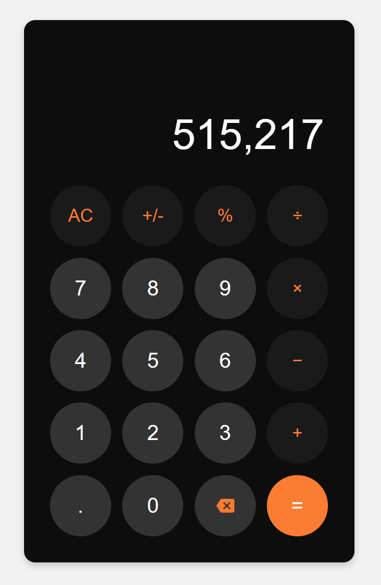

# Calculator App (Basic version)

## Project overview

In this little project, I want to build a simple and nifty calculator app. This calculator does not only do basic math operations (addition, subtraction, multiplication, division) but also can do more intricate operations such as calculating percentages and toggling between positive and negative numbers. Regarding the UI design, I apparently got inspired by iPhone's calculator app. Oh yeah, I'm a hardcore Apple fan!

## Tech stack

This application is built with HTML, CSS, and JavaScript.

## Features

When I started building this calculator, I wanted to create something that wasn't just functional but also user-friendly. Here’s what I aimed for as a casual user:

- See an entry pad containing buttons for the digits 0-9, operations, and others.
- Perform basic arithmetic operations (+, -, *, /).
- Calculate percentages easily with a '%'  button.
- Toggle numbers from positive to negative and back seamlessly by clicking the '+/-' button.
- Clear all entries and reset the display to 0 by clicking the 'AC' (for clear all) button.
- Display large numbers with commas as thousand separators (e.g., 10,000).

## Testing

### Pre-requisites

Before you start testing, ensure you have the following installed:

- Node.js (Download and install from [Node.js website](https://nodejs.org/en))
- npm (Comes with Node.js)

### Setup

- Clone the repo using: `git clone [URL to this repo]`.
- Install dependencies by running: `npm install`.

### Running Tests

- Execute this command in your CLI: `npm test`.
- View the test results, including pass/fail information.

## Next steps

Here’s what I plan to improve in the next version of this app:

- UX/UI: Add two rows in the display: one for showing the operations (e.g., `10+5`) and another for showing the result (e.g., `15`).
- UI: Replace the operator symbols with more aesthetic ones.
- UX: Enter the long sequence of digits and they will automatically expand to 2 rows.
- Code: Refactor the code to replace inline event handling with an Object-Oriented Programming (OOP) approach.

## Contributions

I welcome contributions, feedback, and suggestions! Please feel free to fork the project, open pull requests or issues, or contact me with your ideas.

## License

MIT License.